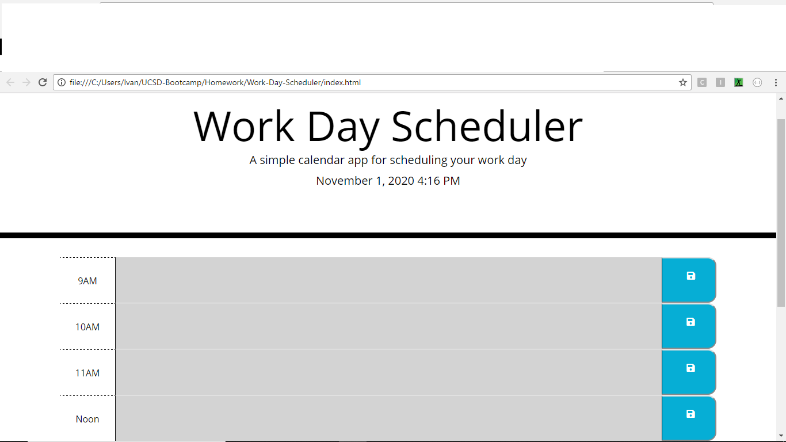
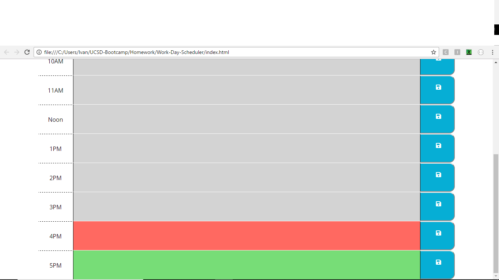

# Work-Day-Scheduler
Creating a simple calendar application that allows for a user to save events for each hour of the work-day.
### Overview 
In this project the objective was to create a basic calendar of the work day, given, a 9am-5pm work shift. 
The user will be able to save events within an hour work block. 
In addition, the calender will keep track of time, by highlighting the hour-blocks in grey, red, and green. 
For example, if the user opens up this application at 8 am, their calendar will be highlighted in green. 
The green tracks if the time is in the future, and if they were to check the calendar at 3 pm, their calendar would be highlighted in all three colors: grey(past),red(present) and green(future).

### Legend

##### Time Tracker:
-***Grey***(past)

-***Red***(present)

-***Green***(future)

### Application Preview 

  
  

 ## Work Day-Scheduler Application Link:
  https://xicano619.github.io/Work-Day-Scheduler/
